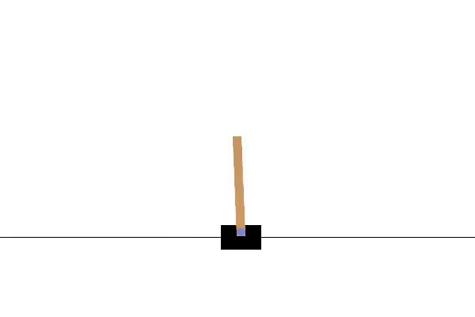
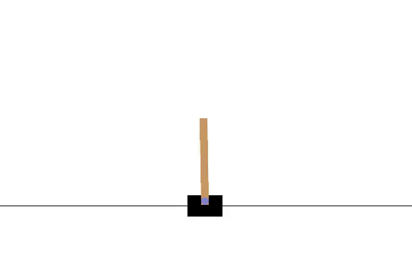

# Reinforcement Learning Projects

This repository contains solutions to two popular OpenAI Gym environments: **Taxi-v3** (solved using Q-learning) and **CartPole-v1** (solved using PPO).

## 1. Taxi-v3 Problem

The **Taxi-v3** environment is a classic discrete-action space problem where the agent needs to pick up and drop off passengers while optimizing rewards. I implemented the solution using **Q-learning**.


### Key Features:
- Solved using Q-learning algorithm.
- Discrete action space with optimal policy convergence.
- The agent learns to maximize rewards by picking up and dropping off passengers efficiently.

---

## 2. CartPole-v1 Problem

The **CartPole-v1** environment is a continuous state-action space problem where the agent must balance a pole on a cart. I solved this problem using the **Proximal Policy Optimization (PPO)** algorithm.
###Random Actions:

###PPO:


### Key Features:
- Solved using PPO (Proximal Policy Optimization).
- Continuous state-action space with stable convergence.
- The agent learns to balance the pole for as long as possible.

---

## How to Run

To reproduce the solutions:
1. Install the dependencies:
   ```bash
   pip install stable-baselines3 gymnasium numpy moviepy
